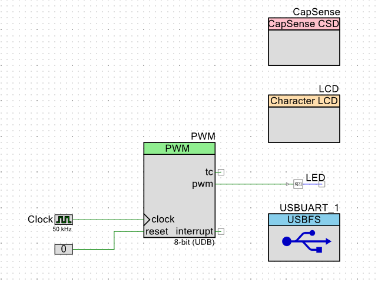
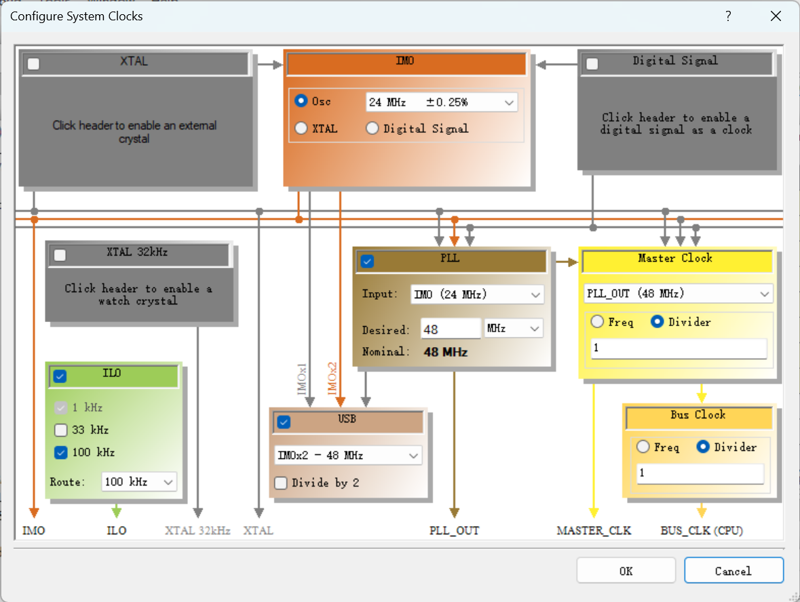

# PSoC提高实验——可调亮度LED灯

本实验中，我利用PSoC Creator编写程序实现了用 Capsense 滑条控制一个 LED 灯的亮度，并将亮度信息通过 UART 传送给上位机。

同时，我还附加了LCD屏幕输出亮度的调试信息与通过上位机控制 LED 亮度的功能。

## 程序运行环境
- PSoC 5 硬件套件
- PSoC Creator 4.2

## 文件说明
- `main.c`：PSoC项目`Source Files`下的主程序文件。

- 顶层设计如下图所示：

- 时钟配置如下图所示：

