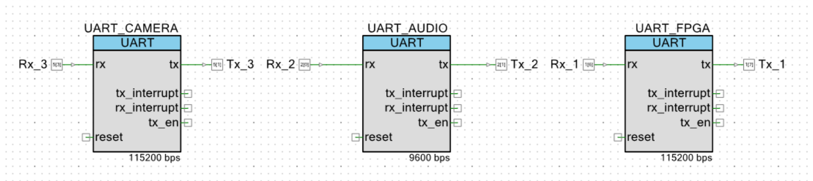

# 创新实验——智能医疗救援车

## 项目简介

我们构建了集成蓝牙、Wi-Fi通信；摄像头、超声波、心率、陀螺仪等传感器；OLED屏幕显示、语音播报模块的智能医疗救援车。其具备蓝牙遥控、智能避障、语音播报、陀螺仪方位检测、心率检测、手写数字识别等复杂功能。

## 运行环境

- PSoC 5 硬件套件
    - PSoC Creator 4.2
- ZYNQ MINI (7010)开发板
    - Vivado 2022.2
    - Nuclei Studio 2022-12

## 文件说明

该部分仅包含由我完成的代码，包含OLED驱动，语音识别模块驱动、手写数字识别部分。

- `nuclei_application/`：此部分包含了我在FPGA板上与PSoC对接的部分，主要用于控制OLED显示。该部分为原项目`application/`文件夹下部分，其余部分修改与`HandwritingRecognition/readme.md`中对前4个文件的介绍一致。
    - `main.c`：开启一个波特率为115200的端口用于接收数据，按约定好的形式接收数据并展示在显示屏上。
    - `oledfont.h`：屏幕显示的字体文件（即ASCII码等对应的“图片”），也加入和欢迎页面、播放声音页面等。
    - `oleddriver.h`：屏幕驱动函数，其中对输出字符串、显示函数等功能和用法有详细介绍，加入了增强版的函数`OLED_ShowString_Enhanced()`、`OLED_ShowString_Stepping()`。

- `psoc_headers/`：打包为头文件后的PSoC上各功能模块。
    - `fpga_connect.h`：用于与FPGA板连接并控制OLED，提供`fpga_init()`函数用于建立UART连接，提供`fpga_SendString()`、`fpga_ClearScreen()`、`fpga_ShowWelcomePage()`函数，在OLED上打印字符串、图片等。
    - `XFS5152.h`：包含语音生成模块的`XFS_init()`初始化连接，`XFS_FrameInfo()`发送文本。
    - `image_utils.h`：包含C语言的图像裁切、下采样、二值化工具函数。与运行环境解耦，可独立使用。
    - `network_tools.h`：包含神经网络的结构体`neural_network_t`，`network_init()`网络权重初始化工具，`network_hypothesis()`网络预测函数，使用完需`network_del()`释放内存。该文件需要`#include "network_values.h"`。
    - `network_values.h`：包含神经网络的权重、偏置等参数。
    - `camera_connect.h`：用于与连接OV7670的Arduino板建立连接（未调试完成，不可用）。

其中PSoC中用到的UART相关函数对应的顶层设计为：
